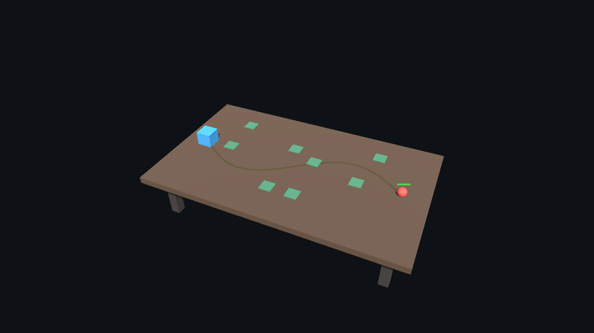

# 3D Stage 1 — 현재 구현 상태

작성일: 2026-10-02

## 완료 범위와 현재 제한

TestStage를 **고정 Perspective 카메라 + 3D 테이블 + XZ 평면 게임 규칙**으로 전환했습니다. 기존 TestStage Scene과 Enemy/Turret Prefab GUID를 유지하여 기존 StageDefinition과 카드 참조가 계속 작동합니다.

**이 단계는 3D 월드 구성 단계입니다. 마우스로 슬롯을 클릭하는 배치와 마우스로 스킬을 조준하는 입력은 아직 사용할 수 없습니다.** 제공된 프롬프트가 완전한 3D 입력 전환을 다음 단계로 지정했으므로 기존 Physics2D/XY 마우스 처리를 중단했습니다. UI의 카드 선택, Pause, Retry 등은 유지됩니다. 배치와 시전의 검증·비용·효과·순환 API는 유지하고 자동 테스트로 확인했습니다. 평상시 Play에서는 적이 생성되어 경로를 따라 Base로 이동합니다.

원본 프롬프트 사본: [3D_Implementation_Stage1.md](3D_Implementation_Stage1.md). 별도 컨셉 스케치는 이번 요청에 첨부되지 않았으므로 문서에 명시된 대각선 카메라와 우측 시작/좌측 Base 조건을 기준으로 구성했습니다.

## 재사용한 시스템

아래 런타임 책임과 데이터 수치는 변경하지 않았습니다.

- CardDefinition 계층, PlayerDeck, Available 계산, Deck Editor, RuntimeCardCycle, GameplayHand의 성공/실패 및 순환 규칙.
- ElixirSystem, ResourceWallet, EnemyKillRewards, BaseHealth.
- Enemy/BasicEnemy, EnemyHealth, EnemySpawner, FixedIntervalSpawner의 생성·피해·사망·보상 구조.
- Turret/BasicTurret 상속, AttackBehaviour/DirectDamageAttack, 기존 쿨다운과 피해 로직. Turret.cs는 선택 범위 Gizmo만 XZ 원으로 수정했습니다.
- GameFlow, Lobby, StageCarousel, 진행도, Pause/Settings/Game Over/Retry.
- Stage/Tower/Enemy/Skill/Card 정의의 기존 통계 수치.

변경이 필요한 부분은 좌표 투영, 마우스 입력의 단계적 중단, 3D 외형 및 표시였습니다. NavMesh, 투사체, 비행 적, 높이 보너스, 새 밸런스는 추가하지 않았습니다.

## Scene 구성

MainMenu는 기존 Scene 그대로입니다. 1-1~1-10은 계속 같은 TestStage Scene을 사용합니다.

```text
TestStage
├── Main Camera                 fixed Perspective
├── Table Light                 Directional Light
├── Battlefield
│   ├── Tabletop                Cube + BoxCollider + TabletopSurface
│   ├── Table Leg × 4           Cube (visual only)
│   ├── WaypointPath
│   │   └── Waypoint 00~16      editable Transforms
│   ├── Path Visualization      LineRenderer + PathVisualization
│   ├── Base
│   │   ├── BaseHealth
│   │   └── Base Visual         Cube
│   ├── PlacementSlots
│   │   └── Slot 1~8            TowerPlacementSlot + BoxCollider
│   │       └── Slot Visual     Cube + PlacementSlotView
│   └── Enemies                 existing runtime spawn parent
├── GameFlow
├── StageSystems                existing systems + SkillCastingController
├── Canvas                      existing screen-space HUD
├── GameplayUI
└── EventSystem
```

카메라는 위치 `(10, 19, -22)`, `(0, 0, 0)`을 바라보는 Perspective, FOV 45°, Near .1 / Far 100으로 구성했습니다. 카메라 이동 스크립트는 없습니다. Transform/FOV는 Scene Inspector에서 조절합니다. 자동 검증 해상도에서 모든 경로와 슬롯의 투영 위치가 화면 안과 Hand 영역 위에 있는지 확인했습니다.

Tabletop은 중심 `(0,-.25,0)`, 크기 `(20,.5,12)`의 Cube입니다. 윗면 Y=0, 유효 X 범위 -10~10, Z 범위 -6~6입니다. 네 다리는 장식이며 Collider가 없습니다. TabletopSurface는 카메라 참조, 월드 영역과 다음 단계용 LayerMasks를 제공하며 게임 상태나 비용 로직을 소유하지 않습니다. 초기 맵은 축에 정렬된 수평 테이블입니다.

## Enemy / Turret 외형

```text
BasicEnemy runtime root (scale 1)
├── BasicEnemy / EnemyHealth / EnemyPathFollower
├── SphereCollider (Enemy layer)
├── EnemyHealthBar
├── Visual
│   └── Sphere                  radius .35, center Y=.35
└── Enemy HP                    runtime world-space Canvas

BasicTurret runtime root (scale 1)
├── BasicTurret / DirectDamageAttack
└── Visual
    ├── Cuboid                  .65 × 1.3 × .65, center Y=.65
    └── ProjectileOrigin        local Y=1.35, currently unused
```

임시 Mesh에는 Enemy/Turret 핵심 컴포넌트를 붙이지 않았습니다. Visual 하위 오브젝트를 교체할 수 있습니다. 기존 15종 타워는 계속 같은 BasicTurret Prefab을 사용합니다. 포탑을 미리 자동 설치하거나 카드를 무상 사용하도록 바꾸지 않았습니다.

## XZ 규칙과 경로

PlanarSpace.Project/World/SqrDistance가 XZ와 평면 좌표 사이의 변환을 명시합니다. 타깃과 스킬 피해의 거리 계산은 Y를 무시합니다. 스킬 API의 Vector2는 이제 `(X,Z)`입니다.

WaypointPath의 배열은 기존처럼 Inspector에서 관리합니다. GetPoint는 각 waypoint의 X/Z와 path root의 Y를 사용합니다. EnemyPathFollower는 path 높이에 맞추고 기존 속도로 경로를 따라 이동합니다. 정상 경로에서 Y=0이며 Mesh의 시각적 높이는 자식 Transform에서 처리합니다.

초기 Scene에는 17개 waypoint를 배치했습니다. 우측 `(8,0,0)`에서 시작하여 Z 방향으로 굽이친 후 좌측 `(-8,0,0)`에서 끝납니다. 초기 authoring 도구만 이 배치를 생성하며 Enemy 코드에 좌표를 넣지 않았습니다. 다음 맵에서는 배열/Transform을 편집하거나 별도 Scene을 지정하면 됩니다.

슬롯 8개는 기존 위치를 XY에서 XZ로 옮긴 Scene 오브젝트입니다. 위치와 개수는 맵에서 편집합니다. TowerPlacementSlot은 점유/하이라이트 상태와 Changed 이벤트만 소유합니다. 필수 Renderer나 Collider 의존성은 제거했고, 실제 Scene에는 별도의 3D BoxCollider를 배치했습니다.

## 교체 가능한 표시

- **PathVisualization**: 실제 WaypointPath를 읽어 LineRenderer를 갱신합니다. 시각적 선은 표면보다 .035 위에 있습니다. 표시를 꺼도 이동에는 영향이 없습니다.
- **EnemyHealthBar**: EnemyHealth 이벤트를 관찰하는 월드 Canvas입니다. 적 위 1.05에 배치하고 카메라 회전을 따라 billboard 처리합니다. Image는 raycastTarget=false입니다. 끄면 숨겨지고 다시 켜면 현재 HP와 동기화됩니다.
- **PlacementSlotView**: 슬롯 Changed 이벤트를 구독하고 MaterialPropertyBlock으로 Available/Highlighted/Occupied 색상을 표현합니다. 제거하거나 꺼도 슬롯의 배치 상태는 유지됩니다.
- Path/Slot 표시에는 ExecuteAlways를 사용하여 Scene 편집 때도 구성 확인이 가능합니다.
- 스킬 원은 기존 조준 API를 호출하면 XZ 평면과 실제 Radius로 그려집니다. 실제 마우스 Raycast 연결은 Stage 2에 남겨두었습니다.

## Collider / Layer 준비

| 오브젝트 | Layer | Collider |
|---|---|---|
| Tabletop | GameplaySurface (9) | BoxCollider |
| Slot runtime root | PlacementSlot (8) | BoxCollider |
| Enemy runtime root | Enemy (10) | SphereCollider |

TabletopSurface에 Surface/Placement/Enemy 마스크를 저장했습니다. 실제 Physics.Raycast로 테이블과 슬롯을 구분할 수 있는지 자동 검증했습니다. 이는 다음 단계 입력 준비 검증이며, 플레이어의 마우스 입력을 이 Raycast에 연결한 것은 아닙니다.

3D Physics는 Unity built-in 모듈 `com.unity.modules.physics`를 직접 의존성으로 명시했습니다. 외부 패키지는 추가하지 않았습니다. 신규 3D 오브젝트에 Physics2D를 사용하지 않으며 TestStage에 Collider2D가 남아 있지 않은 것도 검사했습니다.

## 자동 검증 결과

Unity **6000.6.0f1**, Play Mode **400 assertions 통과**, 종료 코드 0.

- 기존 378개 카드/덱/Elixir/스킬/전투/로비/Pause/Retry 검사를 유지하고, 슬롯 표시와 스킬 원의 좌표 검사만 새 표현에 맞췄습니다.
- 3D 테이블, Perspective 카메라와 고정 Transform, 평면 경로·곡선·방향·속도·높이, 모든 waypoint/slot의 카메라 투영 범위.
- 실제 경로와 표시 선 일치, 표시를 꺼도 이동 가능, HP 표시를 꺼도 피해 정상, 표시 없이도 슬롯 점유 가능.
- Sphere/Cuboid 자식 Mesh 계층, Enemy Collider, ProjectileOrigin 존재.
- 높이에 영향을 받지 않는 최근접 표적과 스킬 AoE, 3D surface/slot raycast mask.
- 기존 15종 포탑 피해·간격·비용·범위, 처치 보상, 혼합 덱, 지연 시전, 같은 스테이지 Retry와 Elixir 초기화.

검증 복사본: `/tmp/defense-stage1-check`

로그: `/tmp/defense-stage1-validation.log`

결과: [ValidationResult.txt](ValidationResult.txt)

원본의 일부 파일이 iCloud 미다운로드 상태여서 사용자 GitHub 저장소의 같은 기준 커밋 `c1de67f`를 임시 폴더로 clone한 뒤 이번 변경을 적용하여 검증했습니다. 검증된 Scene/Prefab/코드를 원본 작업 폴더에 반영했습니다. 원본 Git 이력이나 커밋은 변경하지 않았습니다.

## 시각 확인과 미검증

Unity 카메라의 자동 렌더 이미지를 직접 확인했습니다. 테이블, 고정 대각선 구도, 경로, 슬롯, Sphere 적, HP 바와 Base가 보입니다. 아래 이미지는 **3D 카메라 캡처**라 screen-space overlay HUD는 포함하지 않습니다.



수동 Unity Editor/마우스/키보드 플레이는 수행하지 않았습니다. 기존 UI는 자동 Button/ExecuteEvents 및 컴포넌트 API로 검증했습니다. 다양한 해상도, Windows standalone build, 실제 플레이 조작감은 미검증입니다. 3D 월드 마우스 배치/스킬 조준은 미구현이며 다음 단계의 작업입니다.

기존 Unity Editor SearchDatabase 인덱싱 예외는 기존 테스트 도구가 게임 코드와 구분하여 경고로 기록합니다. 게임 코드의 Error/Exception/Assert는 실패로 처리합니다.

## 변경 파일

### 신규

- Documentation/3D_Implementation_Stage1.md — 원본 프롬프트 사본
- Documentation/3D_Stage1_Report.md — 현재 상태 보고서
- Documentation/3D_Stage1_Preview.png — 자동 렌더 결과
- Assets/Defense/Runtime/World/PlanarSpace.cs
- Assets/Defense/Runtime/World/TabletopSurface.cs
- Assets/Defense/Runtime/World/PathVisualization.cs
- Assets/Defense/Runtime/World/PlacementSlotView.cs
- Assets/Defense/Editor/TabletopStageMigration.cs
- Assets/Defense/Editor/TabletopStageValidation.cs
- Assets/Defense/Art/Materials/{Table,Legs,Enemy3D,Tower3D,Slot3D,Path3D}.mat
- 신규 Unity 파일과 폴더의 .meta

### 수정

- Assets/Defense/Scenes/TestStage.unity
- Assets/Defense/Prefabs/BasicEnemy.prefab, BasicTurret.prefab
- Assets/Defense/Runtime/Enemies/EnemyPathFollower.cs, WaypointPath.cs
- Assets/Defense/Runtime/Placement/TowerPlacementSlot.cs, TurretPlacementController.cs
- Assets/Defense/Runtime/Skills/CircularDamageSkill.cs, SkillCastingController.cs
- Assets/Defense/Runtime/Turrets/ClosestTargeting.cs, Turret.cs
- Assets/Defense/Runtime/UI/EnemyHealthBar.cs, BuildMenuUI.cs
- Assets/Defense/Editor/PrototypeValidation.cs, CardSkillValidation.cs
- ProjectSettings/TagManager.asset
- Packages/manifest.json, packages-lock.json
- README.md, Documentation/Architecture.md, SceneSetup.md, Validation.md, ValidationResult.txt

## 실행과 다음 단계

MainMenu Scene에서 Play → Start Game → Enter Stage로 3D 월드를 확인할 수 있습니다. 현재 Scene/Prefab은 저장되어 있으므로 변환 도구를 다시 실행할 필요는 없습니다. `Defense → Migrate Test Stage to 3D Stage 1`은 이미 변환된 Scene이면 재생성을 건너뛰어 맵 편집을 보존합니다. 초기 2D bootstrap 도구로 Scene을 새로 만든 경우 이 변환 도구를 이어서 실행해야 합니다.

다음 단계에서는 카메라 Ray → Tabletop/Slot hit → 평면 좌표의 공통 월드 입력 경로를 연결하고, 배치 hover/click과 스킬 hold/release를 복구하면 됩니다. 기존 TryPlace/BeginAim/MoveAim/ReleaseAim 및 성공 비용/카드 순환 경로는 준비되어 있습니다.
