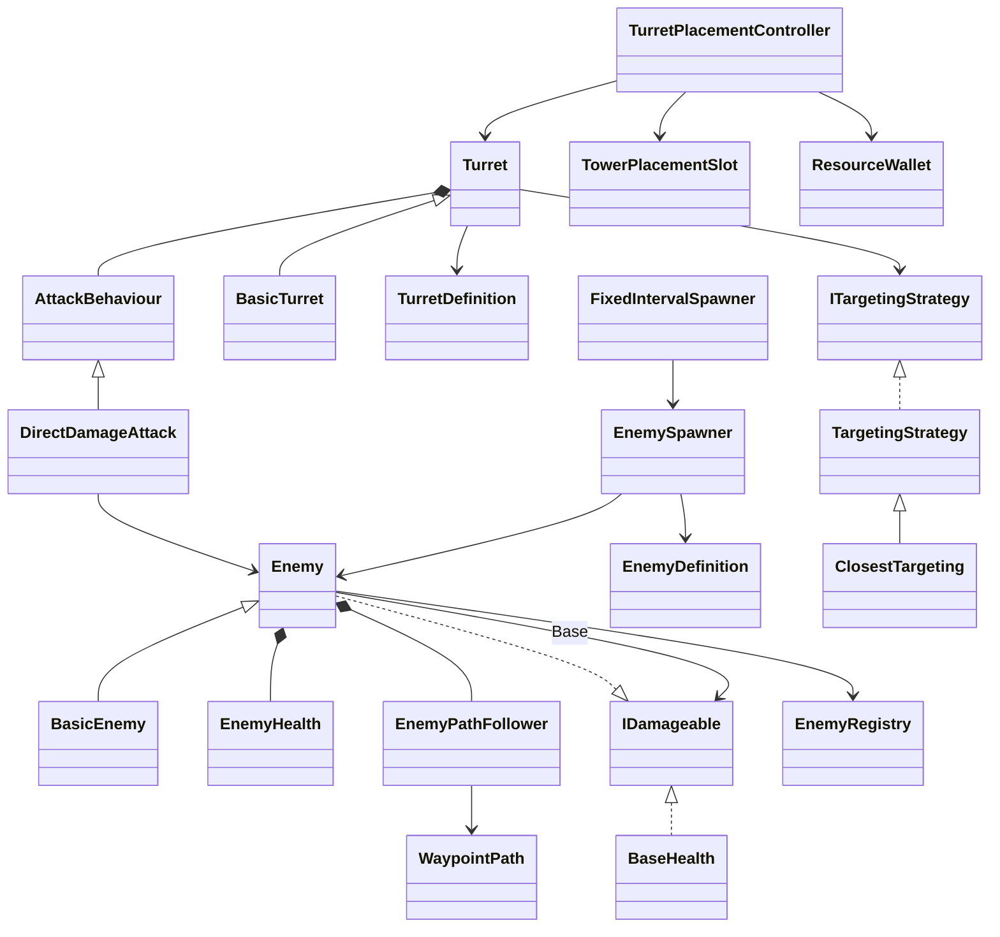

# 구현 구조

## 사전 분석과 결정

작업 시작 시 `GameDesign` 폴더에 기존 Assets, Scenes, Packages 또는 C# 코드가 없었습니다. 세 specification을 먼저 읽고 두 Scene 기반 구성을 제안한 뒤 구현했습니다. 현재 요청의 메시지와 범위를 우선하며 이전 설명의 `Low Cost`는 사용하지 않습니다.

`MainMenu`는 Main Menu / Stage Selection을 패널로 표현하고, `TestStage`는 게임 월드를 소유합니다. 씬 전환은 Unity `SceneManager`를 사용합니다. DontDestroyOnLoad 싱글턴이나 전역 적 목록을 만들지 않아 재진입 시 자원·HP·적·포탑이 자연스럽게 초기화됩니다.

## 컴포넌트 책임

| 컴포넌트 | 책임 |
|---|---|
| MainMenuUI | 메인 메뉴, stage 목록, 해당 씬으로 진입, 앱 종료. 에디터에서는 Play 종료 |
| GameFlow | Playing / Paused / GameOver 전이와 timeScale 소유. Pause와 Esc가 동일한 TogglePause 호출 |
| StageInitializer | 설정 데이터를 각 시스템에 전달하는 씬 초기화 지점. 전투나 UI를 실행하지 않음 |
| BaseHealth | Base HP, 피해 수신, Changed / Depleted 이벤트 |
| ResourceWallet | 자원 잔액, 구매 가능 여부, 지출·수급, Changed 이벤트 |
| EnemyKillRewards | EnemySpawner의 EnemyDefeated 이벤트를 받아 적의 ResourceReward를 Wallet에 지급 |
| EnemySpawner | 정의 에셋의 Enemy 프리팹 생성 및 의존성 전달. 스폰 일정은 모름 |
| FixedIntervalSpawner | 현재 테스트용 시간 간격만 관리. 미래 Wave 스케줄러로 교체할 위치 |
| EnemyRegistry | 해당 스테이지에서 표적으로 사용할 적 목록 |
| WaypointPath | 순서가 있는 Transform 경로 및 에디터 Gizmo |
| EnemyPathFollower | 다음 waypoint로 이동, 코너를 지난 잔여 이동 거리 처리, 종점 이벤트 |
| EnemyHealth | 현재/최대 HP와 Changed / Depleted 이벤트 |
| EnemyHealthBar | EnemyHealth.Changed 구독, HP 비율 표시 및 사망 시 즉시 숨김 |
| Enemy / BasicEnemy | 공통 생명주기, 체력·이동 조합, 사망·Base 도착 처리 / 현재 구체 타입 |
| Turret / BasicTurret | 공통 공격 쿨다운 및 범위 기반 표적 요청 / 현재 구체 타입 |
| ITargetingStrategy / TargetingStrategy | 표적 선택 계약 / Inspector에서 지정 가능한 추상 ScriptableObject |
| ClosestTargeting | 범위 안의 살아 있는 적 중 실제 거리가 가장 가까운 적 선택 |
| AttackBehaviour / DirectDamageAttack | 교체 가능한 공격 실행 컴포넌트 / 현재 즉시 피해 적용 |
| TowerPlacementSlot | Collider2D로 표현된 지정 설치 위치, 포탑 점유 |
| TurretPlacementController | UI 선택, 월드 클릭, UI 클릭 배제, 검증·생성·비용 차감, 결과 메시지 이벤트 |
| BuildMenuUI | StageDefinition의 포탑 목록으로 토글 패널 구성, 선택 요청 및 선택 표시 |
| GameplayUI | HP·자원 표시, 설치 메시지, Pause·종료 확인·Game Over 패널과 키보드 입력 |
| SettingsUI | 메뉴와 Pause에서 재사용되는 placeholder와 Back callback |
| UiFactory | uGUI placeholder 생성만 담당. 게임 규칙을 포함하지 않음 |

## 클래스 관계

타입은 `BasicTurret : Turret`, `BasicEnemy : Enemy`의 얕은 상속으로 표현합니다. 현재 구체 타입의 본문은 비어 있으며 공통 동작을 복제하지 않습니다. 표적 규칙은 상태 없는 공유 에셋, 공격은 포탑별 컴포넌트로 조합합니다. 적의 이동과 체력도 개별 컴포넌트로 분리했습니다. 미래 기능만을 위한 능력·방어력·공중 인터페이스는 만들지 않았습니다.

## 설정 데이터와 런타임

- `StageDefinition`: 표시 이름, 씬 이름, 초기 자원·Base HP, 테스트 적, 간격, 사용 가능한 포탑 목록.
- `EnemyDefinition`: 프리팹, 최대 HP, 속도, Base 피해, 처치 자원 보상(Resource Reward).
- `TurretDefinition`: 프리팹, 표시 이름, 비용, 피해, 범위, 쿨다운, targeting 에셋.
- 런타임: 현재 체력, 자원, 슬롯 점유, 이동 진행, 쿨다운, 일시정지 상태는 각 컴포넌트에만 존재합니다. 에셋은 게임 중 변경하지 않습니다.
- 필드는 private serialized로 Inspector에서 편집하고 코드 외부에는 읽기 전용 속성이나 동작 메서드를 제공합니다.

## 통신

1. `StageInitializer`가 데이터를 전달하고 `BaseHealth.Depleted`를 `GameFlow.GameOver`에 연결합니다.
2. `FixedIntervalSpawner → EnemySpawner.Spawn(EnemyDefinition)`이 적을 생성합니다. 적은 경로·Base의 `IDamageable`·Registry를 전달받습니다.
3. `EnemyHealth.Depleted → Enemy.Die`는 표적 목록에서 즉시 제외한 후 GameObject를 제거합니다. 같은 프레임의 중복 공격도 죽은 적을 표적으로 삼지 않습니다.
4. `EnemyPathFollower.ReachedEnd → Enemy`는 종점 처리를 단 한 번 실행하고 Base에 피해를 줍니다. 적은 UI나 전역 게임 상태를 직접 조작하지 않습니다.
5. `Turret → ITargetingStrategy`가 Registry에서 적을 고른 후 `AttackBehaviour`에 공격을 요청합니다. 공격 가능한 시점마다 다시 선택하므로 사망·범위 이탈·거리 순서 변경을 반영합니다.
6. 설치는 UI 선택 → 유효 슬롯 → 점유 → 자원 → 생성·점유 → 비용 차감 순서입니다. 실패 시 메시지를 이벤트로 UI에 전달하며 자원은 차감하지 않습니다.
7. UI는 Base·Wallet·Flow 이벤트를 구독하고 파괴 시 해제합니다. UI는 전투 수치나 적 목록을 직접 수정하지 않습니다.

## 상태와 UI

Main Menu / Stage Selection은 메뉴 씬의 패널 상태입니다. Gameplay는 `GameplayState` enum을 사용합니다. 작은 prototype에 별도 상태 클래스 계층은 필요하지 않습니다.

Pause는 `Time.timeScale = 0`으로 이동·공격 쿨다운·스폰 타이머를 멈추며, 설치와 직접 스폰 요청은 `GameFlow.IsPlaying`으로 차단합니다. Game Over도 동일하게 정상 게임 진행을 멈춥니다. 씬 종료 시 timeScale을 1로 되돌립니다. 메시지 표시 시간만 unscaledTime을 사용합니다.

- Pause → Settings → Back: Paused 유지
- Pause → Exit → No: Pause Menu, Paused 유지
- Pause → Exit → Yes: MainMenu로 이동
- Paused 상태의 Esc: 열린 Settings/confirmation까지 닫고 Playing으로 복귀
- GameOver 상태의 Esc: 무시

## 확장 지점 — 현재 추가 구현하지 않음

- 새 포탑: 기존 BasicTurret 프리팹·정의의 수치만 바꾸거나, 실제 특수 동작이 필요하면 Turret 하위 타입을 추가합니다. StageDefinition의 Available Turrets에 등록합니다.
- 표적 규칙: TargetingStrategy의 새 구현을 정의 에셋에 연결합니다. Turret 코드를 복제하지 않습니다.
- 투사체: AttackBehaviour의 새 구현을 프리팹에 연결합니다. 생성 위치는 컴포넌트 Transform을 사용할 수 있습니다.
- 새 적: 수치 차이는 EnemyDefinition으로 표현하고 특수 생명주기가 필요할 때만 Enemy를 상속합니다. 독립 능력은 필요 시 컴포넌트로 추가합니다.
- Wave: FixedIntervalSpawner 대신 Stage/Wave/Spawn Instructions를 해석하는 스케줄러가 기존 EnemySpawner.Spawn을 호출하게 합니다. JSON 로더·WaveDefinition 클래스는 아직 없습니다.
- 새 stage: 씬·StageDefinition을 추가하고 MainMenuUI의 목록에 등록합니다. 현재 카탈로그는 스크롤 가능하며 각 stage 씬은 자신의 정의를 참조합니다. 서로 다른 정의가 같은 씬을 동적으로 재설정하는 로더는 현재 범위가 아닙니다.

풀링, 탄도, 승리, 진행도, 저장, 업그레이드, 추가 적/포탑 타입은 구현하지 않았습니다.

## 후속 변경: 적 처치 보상

사용자의 후속 요청에 따라 처치 보상을 추가했습니다. 원본 specification의 보상 제외 범위는 이 변경으로 확장되었습니다. `EnemyDefinition.resourceReward`는 0 이상의 설정값(기본 10)이며, 스폰 시 Enemy 인스턴스에 복사됩니다. `Enemy.Died → EnemySpawner.EnemyDefeated → EnemyKillRewards → ResourceWallet.Add → Changed → HUD`로 통신합니다. Enemy는 Wallet이나 UI를 직접 참조하지 않습니다. Base 도달·비활성화·씬 정리에서는 Died를 발생시키지 않아 보상이 없으며, 사망 처리의 active 가드가 중복 지급을 막습니다.

## 후속 변경: 데이터 기반 테스트 포탑과 표시 컴포넌트

TestTurret1/2/3은 서로 다른 TurretDefinition 에셋이며 모두 기존 BasicTurret : Turret, ClosestTargeting, DirectDamageAttack을 공유합니다. 별도 subclass나 공격 코드 복제는 없습니다. 공격 횟수/초는 기존 AttackCooldown에 1/rate로 저장합니다. BuildMenuUI는 placement.Select(definition)만 호출하고 SelectionChanged 이벤트로 표시를 동기화합니다. 포탑 생성, 비용 검증, 공격은 기존 컴포넌트가 계속 담당합니다.

TurretPlacementController가 2D 슬롯 hit-test와 UI 위 입력 제외를 담당하며, TowerPlacementSlot.SetHovered에 결과를 전달합니다. 슬롯은 available / hovered / occupied 색상만 관리합니다. 점유 상태는 호버 색상보다 우선합니다. HP 바는 적 subclass를 참조하지 않고 EnemyHealth를 관찰하는 별도 view입니다.
